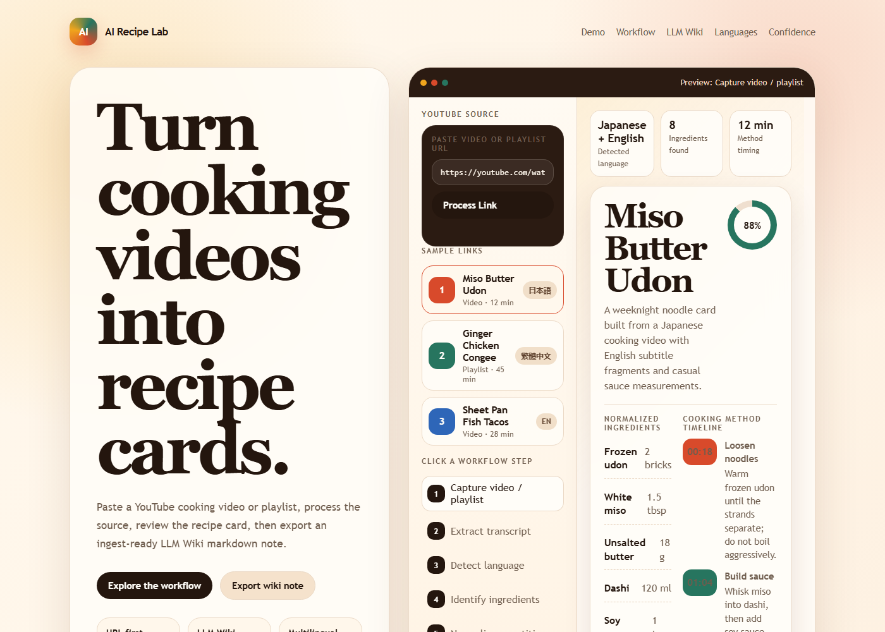

# AI Recipe Lab

<p>
  <a href="https://galvinlam.github.io/ai-recipe-lab/" target="_blank" rel="noopener">
    Open AI Recipe Lab
  </a>
</p>

AI Recipe Lab is a prototype for turning YouTube cooking videos or playlists into recipe notes that can be ingested by LLM Wiki.

The app starts with a YouTube link, simulates the extraction workflow, generates a recipe card, then lets the user copy or download an LLM Wiki-ready markdown file.



## Workflow

```text
YouTube link
  -> transcript + metadata
  -> language detection
  -> ingredients + quantities
  -> cooking timeline
  -> recipe card
  -> copy/download markdown
  -> LLM Wiki raw inbox
```

## LLM Wiki Handoff

The generated markdown includes source URL, language, tags, confidence, ingredients, steps, and review gaps. It is meant to be dropped into an LLM Wiki ingest folder such as:

```text
raw/inbox/recipes/
```

## Current Scope

This public GitHub Pages version is frontend-only. It does not run `yt-dlp`, fetch live transcripts, call an LLM, or write directly into LLM Wiki.

A real connected version would need a backend worker:

```text
URL -> yt-dlp/transcript -> LLM synthesis -> markdown -> LLM Wiki ingest
```

## AI Prompt

```text
Create a static app where a user pastes a YouTube cooking link.
Simulate processing into ingredients, steps, confidence gaps, and a recipe card.
Export the selected recipe as markdown for LLM Wiki ingest.
Keep the UI screenshotable and multilingual.
```

## Run Locally

```powershell
cd "~/projects/ai-recipe-lab"
python -m http.server 8000
```

Then open `http://localhost:8000`.
